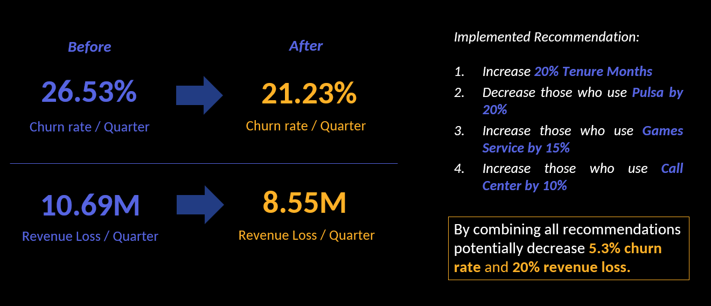

# Telco-Customer-Churn

## Project Overview
This project is part of Data Competition on Data Science Weekend 2023 by Data Science Indonesia collaborated with Telkomsel the data used in this analysis is synthetic and only used for educational purposes. The project is about creating a solution to customer churn problem through analytics and dashboard. 

## PACE Framework
To make the project easier to navigate We used PACE framework which stands for Plan, Analyze, Construct, and Execute. This framework helps to overcome the complexity of the project and finding consistent ways to work together and enable more productive communication.

### Plan
#### Business Understanding
Customer churn refers to customers stopping or discontinuing their relationship with a business. The current churn rate is 26%, below the industry benchmark of 31% in the Telecommunications sector by 2022[1]. The objective is to reduce the churn rate by up to 5% by identifying key factors driving churn.

#### Defining Objective
The objective is to reduce the churn rate by 5%, with a specific focus on factors influencing customer churn.

### Analyze
#### Exploratory Data Analysis (EDA)
The EDA follows six practices: discovering, structuring, joining, validating, cleaning, and presenting. It's an iterative and non-sequential process. That's why they have flexible order and multiple occurences as demonstrated in the following picture.

#### Discovering
The Dataset used in this project consist of 7043 rows, and 16 columns that covers a diverse set of informations such behavioral pattern (Tenure Months, Montly Purchase, Payment Methods, Device Class) and product usage such as whether or not users use certain products Music products, Video products and Gaming products.

#### Cleaning
No duplicated values and outliers were observed.

#### Structuring
In the structuring phase we observed trends and looks at specific segments to understand the trends. Here are the findings:

Trends observed:
- 49% of churners have less than 10 months tenure.
- 69% use high-end devices.
- 44% have higher usage of video products.
- 16% use call centers less frequently.
- 57% use pulsa as a payment method.
- Average monthly charge is 96K rupiah.

Infographics dashboard:

Behavioral segmentation:

The segmentation employed using tenure months and monthly purchase reveals four type of customers. Those who have low tenure months with low monthly purchase, low tenure months with high monthly purchase, high tenure months with low monthly purchase, and high tenure months with high monthly purchase. Out of those four the low tenure months and high monthly purchase have the highest proportions of churn customers (31.29%). You can find the detailed analysis on /`structuring/segmentation` notebook.

### Construct
#### Choosing the best model
In this step we construct multiple models and choose who works best based on specific considerations. First it must have good performance, second it must be explainable. In this case we choose logistic regression the reason is not solely because of the highest f2-score in test data but the model is also faster to tuned and easier to explain compare to other types of model.

#### Tune the choosen model
After choosing specific model we tune the choosen model based on different sets of parameter to achieve the better score.

#### Feature Importance
By analyzing the coefficient of the model we are able to identify the key features that affects churn rate. In logistic regression model the coefficient can be interpreted using odds ratio to find how much particular feature affect the model. In this case, the top 3 most impactful feature on determining the customer churn is tenure months, device class, and pulsa as a payment method. Here is the more detailed breakdown:

- If the customer has higher **Tenure Months**, their odds of getting churned is decreased by 0.15 times.
- If the customer has higher **Device Class** or for each one-unit increase in Device Class, their odds of getting churned is increase by 5.39 times.
- If the customer use **Payment Method_Pulsa**, their odds of getting churned is increase by 1.63 times more than those who use Credit Card as Payment Method.

#### Sensitivity Analysis
In this step we analyze how the model output change given certain input. For example, given tenure months, device class, and payment method how does the change in these variables affect the output? in this case churn rate. It turns out we can reduce churn rate by 5.3% if we increased the tenure months by 20%, decrease those who use pulsa as payment method by 20%, increase those who use games service by 15% and increase those who use call center by 10%. For the analysis take a look the notebooks inside this folder `/sensitivity-analysis/`.

### Execute
The last phase is about sharing our work, for this We create report by creating presentation deck. The final output is provided [here](https://docs.google.com/presentation/d/14xhenNTb-oBI6nLgG6xDxbaTYc3RSdX_/edit)

## References
[1] What’s the Average Churn Rate by Industry? - https://customergauge.com/blog/average-churn-rate-by-industry